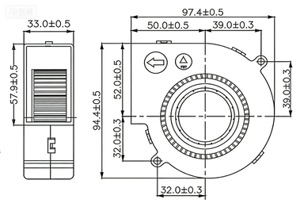

___A HEPA air purifier.___

___You need to download the files listed in the following table.___

| Board                                                        | Enclosure                                                    | Program                                                      |
| ------------------------------------------------------------ | ------------------------------------------------------------ | ------------------------------------------------------------ |
| [BOM_V1.0.1.xlsx](https://github.com/LoongEcho/SolderingFumeExtractor/blob/main/Board/BOM_V1.0.1.xlsx) | [Module_HEPA_V3.0.3MF](https://github.com/LoongEcho/SolderingFumeExtractor/blob/main/Enclosure/Latest/Module_HEPA_V3.0.3MF) | [SolderingFumeExtractor.bin](https://github.com/LoongEcho/SolderingFumeExtractor/blob/main/Program/SolderingFumeExtractor.bin) |
| [Gerber_V1.0.1.zip](https://github.com/LoongEcho/SolderingFumeExtractor/blob/main/Board/Gerber_V1.0.1.zip) | [Module_SlidingBlock_V3.0.3MF](https://github.com/LoongEcho/SolderingFumeExtractor/blob/main/Enclosure/Latest/Module_SlidingBlock_V3.0.3MF) | OR                                                           |
|                                                              | [TheFanFrame_Branch_v3.0.1 -.3MF](https://github.com/LoongEcho/SolderingFumeExtractor/blob/main/Enclosure/Latest/TheFanFrame_Branch_v3.0.1 -.3MF) | [SolderingFumeExtractor.hex](https://github.com/LoongEcho/SolderingFumeExtractor/blob/main/Program/SolderingFumeExtractor.hex) |

___You need to purchase a fan with the following parameters___

___Fan Parameters：___

